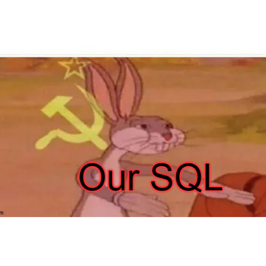

# OurSQL

## Hosted live at: [muskemteers/OurSQL](https://muskemteers.github.io/OurSQL/) (Development stage only)

### Details:

A platform which will act as a basic MySQL client for testing basic MySQL queries and showing results accordingly.

We are trying to make an SQL compiler where we are storing all the data in JSON format and casting it to act like MySQL tables. Later, we will add Node authentication and Mongo-DB support to save individual user's testing databases(for his/her future usage/purposes).

This project is evergreen and work will be done continuosly for at least next 2 years. Hence, if you are GitHub beginner, you can contribute to this project and it will act as pseudo-open-source contribution.

## Contributions ##

Right now, there is no Contributing.md for specific contribution guidelines. Although this repo is open to pull requests, so just do it :P
